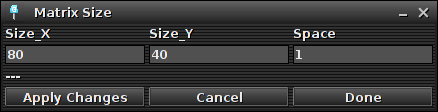

# CeilingMatrixEmulator

This python script, tries to emulate the hardware of the ceiling pixel lamp, 
by creating a virtual serial port for the input and renders the output into a pygame window.

You can use it to test for example animations and games on your local machine, without the use of the actual hardware.

This experimetal branch adds a non blocking serial read, with the help of a thread.

## Requirements:
- python (2.x / 3.x)
  - https://www.python.org/downloads/
- python pygame library
  - https://www.pygame.org/wiki/GettingStarted

### Optional for Glediator:
- Glediator
  - http://www.solderlab.de/index.php/software/glediator
- java
  - https://www.java.com/inc/BrowserRedirect1.jsp
- java rxtx library for serial communication
  - https://github.com/rxtx/rxtx

## Getting started:
```bash
git clone https://github.com/c3e/CeilingMatrixEmulator.git
cd CeilingMatrixEmulator
python MatrixEmulator.py
# Create a symlink, based on the printed message 
# exp: ('Hey use this serial port:', '/dev/pts/7')
# so other application (like glediator) can see and use it.
sudo ln -s /dev/pts/7 /dev/ttyUSB99
```


## Setup Glediator for Testing:

#### Matrix Size Options



- Current settings for the (hopefully soon to be) finished ceiling pixel lamp @c3e lounge
- Size x: 80 pixels
- Size y: 40 pixels
- Space: 1 (only in use for the preview in Glediator)

#### Output Options


- Output mode needs to be "Glediator_Protocol"
- As of now, the emulator only supports the pixel & board order "HL_TL"
- Color order: RGB
- Board size x & y: 8 (so you get the 10 by 5 panel grid)
- You can ignore the "Baud-Rate" value

### TODO's:
- [ ] fix virtual serial port name, so you don't need a symlink
- [ ] thread for serial reading, to make it non-blocking
- [ ] add "real" pixel and board order of ceiling for @c3d lounge (pixel: SL\_BL, board: HL\_BL)

#### config menu for rendering
- [ ] Pixel spacing
- [ ] Panel spacing
- [ ] Pixel width & height

#### config menu for panel & pixel
- [ ] Panel order inside grid
- [ ] Pixel order inside panel
- [ ] number of pixels 

#### support for more pixel and board orders:
- [ ] HS\_TL - horizontal snake, top left
- [ ] HS\_TR - horizontal snake, top right
- [ ] HS\_BL - horizontal snake, bottom left
- [ ] HS\_BR - horizontal snake, bottom right
- [X] HL\_TL - horizontal line, top left
- [ ] HL\_TR - horizontal line, top right
- [ ] HL\_BL - horizontal line, bottom left
- [ ] HL\_BR - horizontal line, bottom right
- [ ] VS\_TL - vertical snake, top left
- [ ] VS\_TR - vertical snake, top right
- [ ] VS\_BL - vertical snake, bottom left
- [ ] VS\_BR - vertical snake, bottom right
- [ ] VL\_TL - vertical line, top left
- [ ] VL\_TR - vertical line, top right
- [ ] VL\_BL - vertical line, bottom left
- [ ] VL\_BR - vertical line, bottom right
